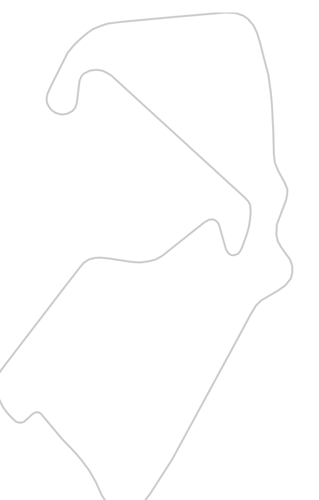
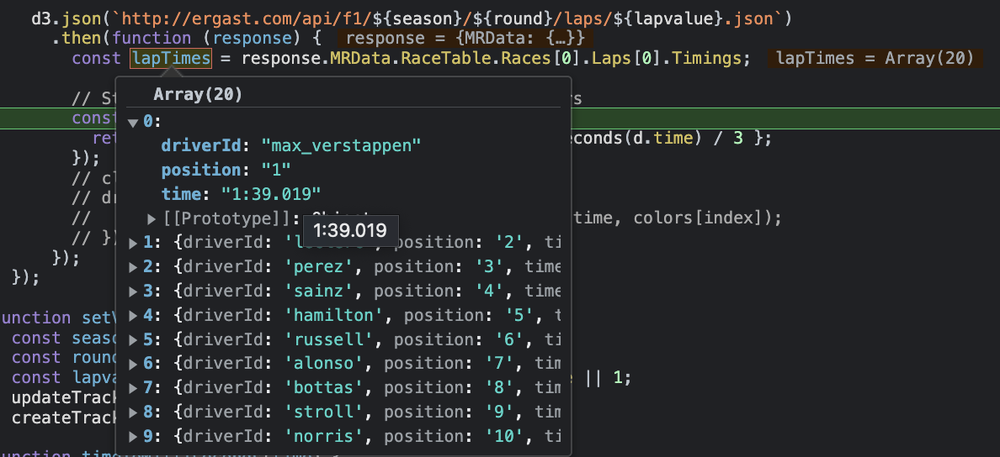

# F1 lap timing vizualization using D3

We are going to make approximate visual representation of lap times by all the drivers over different seasons.

First, we need to display the track. For this we are going to use d3's geo projection api.
It allows you to map the geojson file on the svg. we will draw out

```html
<body>
  <svg id="track"></svg>
</body>
```
```javascript
  const svg = d3.select("#track");
  const projection = d3.geoMercator();
  const getPath = d3.geoPath().projection(projection) // a helper function to get the path from the projected data.

  d3.json("./gb-1948.json").then(function (geojson) {
    projection.fitHeight(200, geojson);
    projection.fitWidth(300, geojson);
    const path = svg.append("path").attr("d", getPath(geojson));
  })
```

that's it.. this wil generate a map which looks like this


Now that we have track, we need timing data of all the drivers of a particular <b>lap</b> of a particular <b>round</b> of that <b>season</b>.

[Erngast Developer API](http://ergast.com/mrd/) has rich set of api to get various f1 related data.

We are going to use the following api to get what we need 

```javascript
 d3.json(`http://ergast.com/api/f1/${season}/${round}/laps/${lapvalue}.json`)
    .then(function (response) {
        const lapTimes = response.MRData.RaceTable.Races[0].Laps[0].Timings;
    })
```



Now, we can use this data to visualize drivers on the track that we created earlier.

```javascript
 drivers.forEach(function (driver, index) {
    transitionDriverMarker(driver.driver, driver.time, colors[index]);
  });
```

this function takes care of creating a marker for a driver & moving it along the track.

```javascript
function transitionDriverMarker(driverId, time, color) {
      var markerGroup = svg.append("g")
        .attr("class", "marker");

      var pathLength = path.node().getTotalLength();
      markerGroup.append("circle")
        .attr("r", 8)
        .style("fill", "none")
        .attr("stroke", fillColor)

      markerGroup.append("text")
        .attr("stroke", fillColor)
        .text(driverId) // Replace with your desired text
        .attr("class", "marker-text");
      markerGroup.transition()
        .duration(time) // Transition duration in milliseconds
        .attrTween("transform", translateAlong(path.node()));
    }

    // this is where actual magic is happening..
    function translateAlong(path) {
      var l = path.getTotalLength();
      return function (d, i, a) {
        return function (t) {
          var p = path.getPointAtLength(t * l);
          return "translate(" + p.x + "," + p.y + ")";
        };
      };
    }
```

This is final result 

